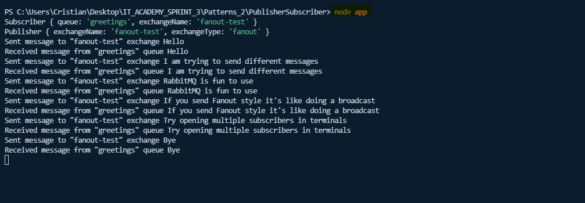
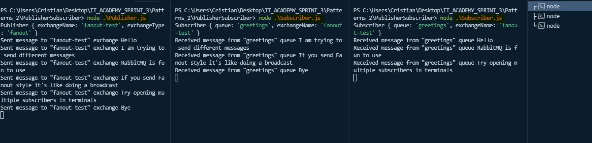

## RabbitMQ in Publisher/Subscriber Pattern - Nodejs
### **Using exchange type Fanout**
Simple exercise using RabbitMQ implementing in a subscriber/publisher pattern.  
Both classes, Consumer and Publisher are exported as singleton instance to be run in app.js automatically.  
A small delay has been applied at the time of sending messages in the Publisher class to show sending and receiving message by message.


### HOW TO USE
In a simple terminal
```
node app
```


<dl>
  <dt>In multiple terminals</dt>
  <dd>Open at least two terminals (in the example there are three terminals)</dd>
  <dd>Start subscribers first</dd>
</dl>


```
node Subscriber
```

After starting the publisher

```
node Publisher
```


The fanout exchange is very simple. As you can probably guess from the name, it just broadcasts all the messages it receives to all the queues it knows. And that's exactly what we need for our logger.